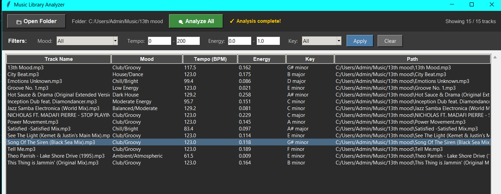

# 🎵 Mood Detector

[](https://www.python.org/downloads/)
[](https://opensource.org/licenses/MIT)
[](https://librosa.org/)
[](https://fastapi.tiangolo.com/)
[](https://github.com/wedsmoker/Mood-Detector/blob/main/CONTRIBUTING.md)

**Open-source music mood analysis API.** The free alternative to proprietary music intelligence APIs.

Analyze audio files to detect mood, tempo, energy, key, and genre characteristics—without sending data to third parties or paying per-request fees.

---

## 🚀 Quick Start

**Three ways to use it:**

### 1️⃣ Music Library Analyzer (GUI App)
Analyze your entire music collection and filter by mood, tempo, energy, and key.

```bash
# Make sure the API is running first (see below)
python music_library_app.py
```



**Features:**
- 📁 Scan entire folders recursively
- 🔍 Analyze all tracks automatically
- 🎚️ Filter by mood, tempo, energy, key
- 💾 Caches results for instant loading
- 🎨 Dark theme, foobar2000-style UI

---

### 2️⃣ REST API
Run a local API server for integration with other apps.

```bash
# Install and run
pip install -e .
python api/main.py

# Or with Docker
docker run -p 8000:8000 wedsmoker/mood-detector
```

**Test it:**
```bash
curl -X POST http://localhost:8000/analyze -F "file=@song.mp3"
```

**Response:**
```json
{
  "mood": "House/Dance",
  "tempo": 124.5,
  "energy": 0.156,
  "key": "F major",
  "explanation": "Moderate energy (0.156), dance tempo (124.5 BPM), bright/sharp timbre, key of F major"
}
```

**Interactive Docs:** Open `http://localhost:8000/docs` for a web UI to test the API.

---

### 3️⃣ Python Library
Use directly in your Python code.

```bash
pip install -e .
```

```python
from mood_detector import analyze_audio

result = analyze_audio("song.mp3")
print(f"Mood: {result.mood}")
print(f"Tempo: {result.tempo} BPM")
print(f"Energy: {result.energy}")
print(f"Key: {result.key}")
```

---

## ✨ Features

- ✅ **Runs locally** - No API keys, no cloud services
- ✅ **Fast** - ~2 seconds per track
- ✅ **No ML dependencies** - Uses signal processing (librosa)
- ✅ **Works offline** - 100% local processing
- ✅ **Multiple formats** - MP3, WAV, FLAC, OGG, M4A, AAC
- ✅ **DJ-oriented moods** - House, Techno, Disco, DnB, Ambient, etc.
- ✅ **Multiple interfaces** - GUI app, REST API, Python library, CLI
- ✅ **Free forever** - MIT license

---

## 🎯 Use Cases

**For Developers:**
- Build music player apps with mood-based filtering
- Create smart playlist generators
- Add music intelligence to DJ software
- Organize large music libraries programmatically

**For Music Lovers:**
- Analyze your entire music collection
- Find tracks by mood/energy/tempo
- Discover forgotten gems with specific vibes
- Create mood-based playlists

**Why not just use [proprietary service]?**
- ❌ Requires internet connection
- ❌ Costs money per request
- ❌ Sends your music/data to third parties
- ❌ API keys, rate limits, vendor lock-in

**This project:**
- ✅ Works offline
- ✅ Free forever
- ✅ Runs on your machine
- ✅ Open source, fully transparent

## API Reference
See [docs/API.md](docs/API.md)

## How It Works
See [docs/HOW_IT_WORKS.md](docs/HOW_IT_WORKS.md)

## Contributing
PRs welcome! See [CONTRIBUTING.md](CONTRIBUTING.md)

## 📊 Detected Moods

The algorithm detects these mood categories based on tempo, energy, and spectral characteristics:

**Dance/Electronic:**
- House/Dance, Dark House
- Disco/Funk, Club/Groovy
- Techno/Dark, Techno/Industrial
- Drum & Bass, Breakbeat/Fast
- Energetic/Rave, Driving Electronic

**Chill/Ambient:**
- Ambient/Drone, Ambient/Atmospheric
- Atmospheric Pad, Atmospheric/Textural
- Downtempo/Dark, Downtempo/Relaxed
- Ambient/Chill, Melancholic/Sad

**Experimental:**
- Glitch/Experimental
- Harsh Noise/Experimental
- Noise/Experimental

**High Energy:**
- Hard/Aggressive
- Energetic/Rave

Plus tempo (BPM), energy level (0-1), musical key, and brightness characteristics.

---

## 🔧 How It Works

1. **Audio Feature Extraction** (librosa)
   - Tempo detection via beat tracking
   - Energy via RMS (root mean square)
   - Brightness via spectral centroid
   - Key detection via chroma features

2. **Rule-Based Classification**
   - Combines tempo + energy + brightness
   - Detects major/minor keys
   - No neural networks needed

3. **Fast & Lightweight**
   - Analyzes first 30 seconds
   - ~2 seconds per track
   - Pure signal processing

---

## 🛠️ Installation

### For Development:

```bash
git clone https://github.com/wedsmoker/mood-detector
cd mood-detector

# Create virtual environment
python -m venv venv
source venv/bin/activate  # or venv\Scripts\activate on Windows

# Install in editable mode
pip install -e .
```

### Run the API:
```bash
python api/main.py
# API at http://localhost:8000
# Docs at http://localhost:8000/docs
```

### Run the Music Library App:
```bash
python music_library_app.py
```

---

## 🐛 Known Issues

- **BPM Detection:** May be inaccurate for tracks with long ambient intros (only analyzes first 30 seconds)
- **Genre Overlap:** Some tracks fit multiple categories
- **Key Detection:** Works best with clear harmonic content

Pull requests welcome to improve accuracy!

---

## 🤝 Contributing

PRs welcome! See [CONTRIBUTING.md](CONTRIBUTING.md)

Areas that need work:
- Improved tempo detection for tracks with intros
- More genre categories
- Better key detection algorithm
- UI improvements for the music library app

---

## 📝 License

MIT - Use it however you want

---

## 💡 Credits

Uses:
- [librosa](https://librosa.org/) - Audio analysis
- [FastAPI](https://fastapi.tiangolo.com/) - REST API
- [scikit-learn](https://scikit-learn.org/) - Feature processing